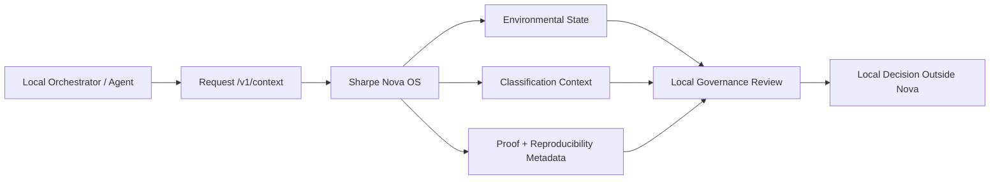
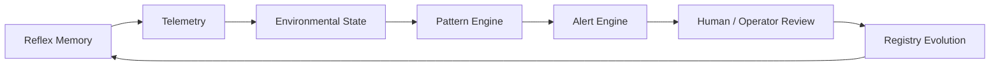
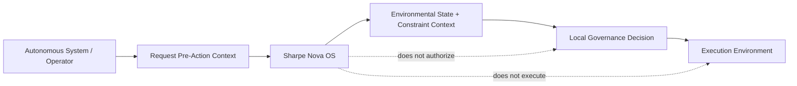
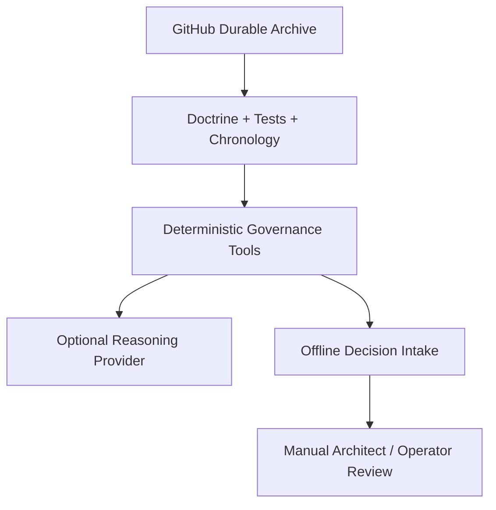
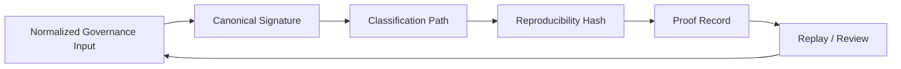

# Sharpe Nova OS Overview

Sharpe Nova OS is pre-execution environmental governance infrastructure for autonomous capital systems.

Nova emits environmental state, classification context, reproducibility metadata, source segmentation, and non-authority telemetry before local systems decide whether or how to act.

Nova does not authorize execution. It does not move capital, recommend trades, predict markets, or optimize portfolios.

The system is designed to make pre-action governance context reproducible, inspectable, and usable before autonomous workflows proceed.

The interaction surface is intentionally narrow and stable:

- `/v1/context` returns a Coordination Record and `decision_id` (preserved)
- `/v1/proof/{decision_id}` verifies the derived coordination context

## What the System Provides

- receives a proposed decision context
- derives an admissibility environment and coordination-state telemetry
- returns conditioning metadata for downstream orchestration
- provides verifiable proof of the derived environmental state

## What the System Does Not Do

- generate trades
- optimize strategy
- execute orders
- provide prescriptive signals or recommendations

## Core Model

Sharpe Nova OS emphasizes environmental conditioning and coordination. The system is designed so that:

- emitted coordination postures are explicit
- governance layers and sovereign internals are not exposed
- downstream systems consume conditioning telemetry and apply local orchestration rules

## Authority Model

- The coordination record is a derivative environmental artifact intended for conditioning.
- Supporting fields explain telemetry and constraint analysis.
- Proof verifies the derived context.
- No external consumer should infer sovereign reasoning or internal policy weights from emitted fields.

## Architecture Diagrams

### Pre-Action Context Flow

### Governance Loop

### Sovereignty Boundary

### Continuity Stack

### Deterministic Proof and Classification Loop

