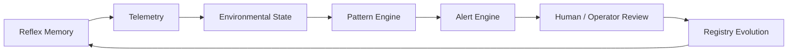
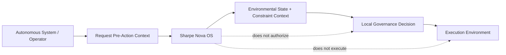
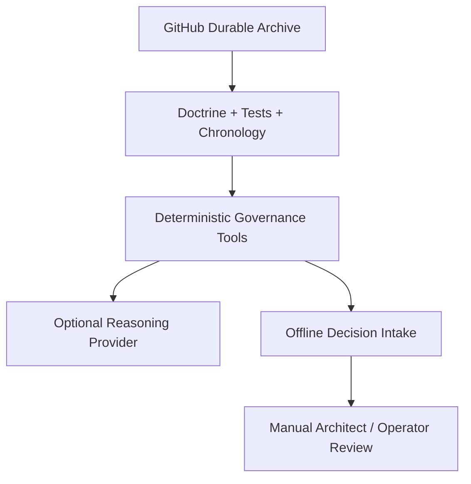

# Overview

Sharpe Nova OS is environmental governance infrastructure that provides derivative environmental context to condition upstream execution environments prior to any capital movement.

It exists to emit coordination context — structured admissibility environments, constraint pressure indicators, pacing conditions, and derivative telemetry — which integrators consume to adapt orchestration behavior. Nova does not grant execution authority, recommend trades, or act as a signal generator.

The interaction surface is intentionally narrow and stable:

- `/v1/context` returns a Coordination Record and `decision_id` (preserved)
- `/v1/proof/{decision_id}` verifies the derived coordination context

## What the System Provides

- receives a proposed decision context
- derives an admissibility environment and coordination-state telemetry
- returns conditioning metadata for downstream orchestration
- provides verifiable proof of the derived environmental state

## What the System Does Not Do

- generate trades
- optimize strategy
- execute orders
- provide prescriptive signals or recommendations

## Core Model

Sharpe Nova OS emphasizes environmental conditioning and coordination. The system is designed so that:

- emitted coordination postures are explicit
- governance layers and sovereign internals are not exposed
- downstream systems consume conditioning telemetry and apply local orchestration rules

## Authority Model

- The coordination record is a derivative environmental artifact intended for conditioning.
- Supporting fields explain telemetry and constraint analysis.
- Proof verifies the derived context.
- No external consumer should infer sovereign reasoning or internal policy weights from emitted fields.

## Architecture Diagrams

### Governance Loop

### Sovereignty Boundary

### Continuity Stack

